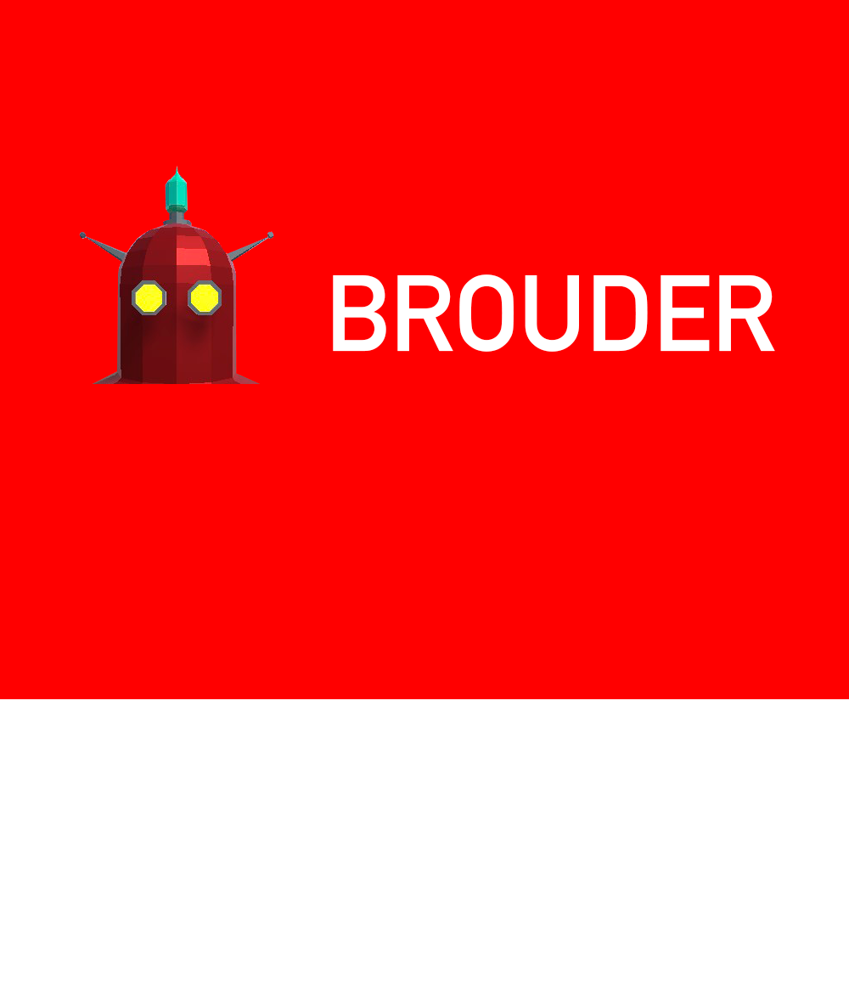

# Brouder - The Videogame

## Made for the Z-Jam 2019.
### Made in Unity3D.

Videogame made in less than 48 hours (Currently making updates) that centers around the user teaching robots to bring the right boxes to their correspondant colors, then when they finish, they will teach other robots how to behave.

## Members
* @DjComet - Albert Abad
* @AbsideDeAuberon - Álvaro Tomás
* @DaniGMX - Daniel Gracia
* @Marutho - Javier Jiménez
* @gabivlj - Gabriel Villalonga
* @kogatell - Jorge Solano (Not participated in Z-Jam, only Mobile and VR Implementations)

## Captures

© All rights reserved
